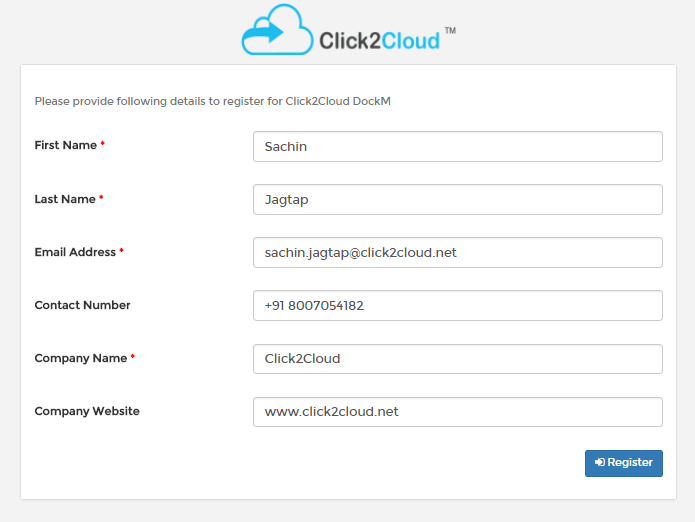
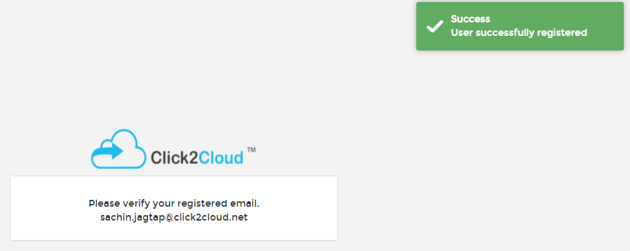
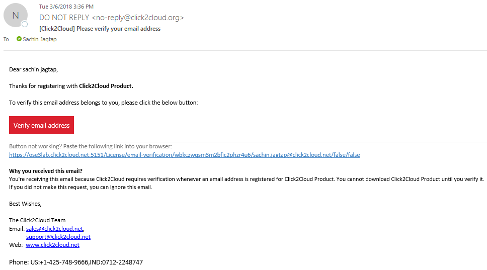
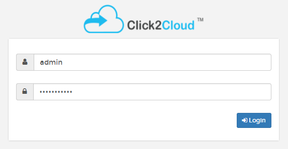

## How to register for Click2Cloud product?

- Click2Cloud products are integrated with the license which you can use for **30** days trial period, please register with your corporate email as public domain emails are not allowed.
 
  

- Enter all the mandatory details and click on **Register** button.

- After successful completion of registration process, you will receive verification email on your registered email address.
  
   

- Click on verify email address button to verify your email.

   

- Already registered users will be directly redirected to the authentication page.

  

- Click2Cloud producuts license expires after **30** days of trial period.

  

- Please contact us at [sales@click2cloud.net](sales@click2cloud.net) or [support@click2cloud.net](support@click2cloud.net)  for any queries.
